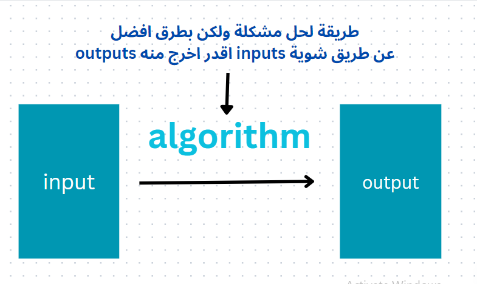

"# grokking-algorithm" 

# what is the Algorithm:
 algorithm is any well-defined computational procedure that takes
some value, or set of values, as input and produces some value, or set of values, as
output. An algorithm is thus a sequence of computational steps that transform the
input into the output.

