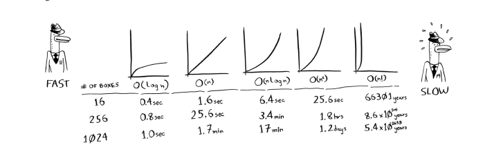

# `what is the Algorithm:`
algorithm is any well-defined computational procedure that takes
some value, or set of values, as input and produces some value, or set of values, as
output. An algorithm is thus a sequence of computational steps that transform the
input into the output.

For example, given the input sequence (31; 41; 59; 26; 41; 58), a sorting algorithm
returns as output the sequence (26; 31; 41; 41; 58; 59)

`but whats the kind of solution ? and what the difference between them?`
`Algorithm put the rules of this to choose between them`

> thinking of a number between 1 and 100.
> You have to try to guess my number in the fewest tries possible. With 
every guess, I’ll tell you if your guess is too low, too high, or correct.
Suppose you start guessing like this: 1, 2, 3, 4 …. Here’s how it would 
go

- A better way to search Here’s a better technique. Start with 50.
- Too low, but you just eliminated half the numbers! Now you know that 
1–50 are all too low. Next guess: 75. 
- Too high, but again you cut down half the remaining numbers! With 
binary search, you guess the middle number and eliminate half the 
remaining numbers every time. Next is 63 (halfway between 50 and 75)

 its called a `binary search` its takes a `7steps` and thats a big diffrent

> An algorithm is said to be correct if, for every input instance, it halts with the
correct output. 
> We say that a correct algorithm solves the given computational
problem. An incorrect algorithm might not halt at all on some input instances, or it
might halt with an incorrect answer

# `the keyword is: Efficiency`
 - time complexity 
 - and space in memory are taken 

 

### `Big O notation`
Big O notation is special notation that tells you how fast an algorithm is. 
Who cares? Well, it turns out that you’ll use other people’s algorithms 
often—and when you do, it’s nice to understand how fast or slow they 
are. 

### `Some common Big O run times`
- O(log n), also known as log time. Example: Binary search.
- O(n), also known as linear time. Example: Simple search.
- O(n * log n). Example: A fast sorting algorithm, like quicksort 
- O(n2). Example: A slow sorting algorithm, like selection sort 
- O(n!). Example: A really slow algorithm, like the traveling 
salesperson 

`note:`
-  Algorithm speed isn’t measured in seconds, but in growth of the 
number of operations.
- Instead, we talk about how quickly the run time of an algorithm 
increases as the size of the input increases
-  Run time of algorithms is expressed in Big O notation
- O(log n) is faster than O(n), but it gets a lot faster as the list of items 
you’re searching grows.

