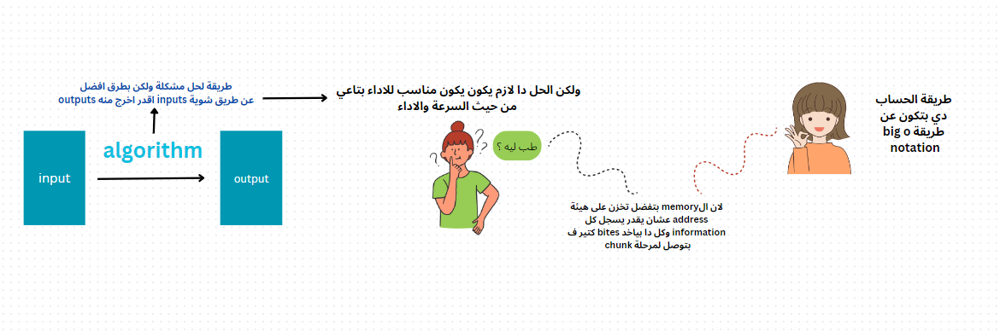

# `what is the Algorithm:`
algorithm is any well-defined computational procedure that takes
some value, or set of values, as input and produces some value, or set of values, as
output. An algorithm is thus a sequence of computational steps that transform the
input into the output.

For example, given the input sequence (31; 41; 59; 26; 41; 58), a sorting algorithm
returns as output the sequence (26; 31; 41; 41; 58; 59)

# `but whats the kind of solution ? and what the difference between them?`
#  `Algorithm put the rules of this to choose between them`

> An algorithm is said to be correct if, for every input instance, it halts with the
correct output. 
> We say that a correct algorithm solves the given computational
problem. An incorrect algorithm might not halt at all on some input instances, or it
might halt with an incorrect answer

# `the keyword is: Efficiency`
 - time complexity 
 - and space in memory are taken 

# computer memory was free and fast

> Algorithms and other technologies
> Total system performance depends on choosing efficient
> algorithms as much as on choosing fast hardware. Just as rapid advances are being
made in other computer technologies, 
they are being made in algorithms as well.

` the advanced technologies are used algorithm such as:`

- advanced computer architectures and fabrication technologies,
- easy-to-use, intuitive, graphical user interfaces (GUIs),
- object-oriented systems,
- integrated Web technologies, and
- fast networking, both wired and wireless

